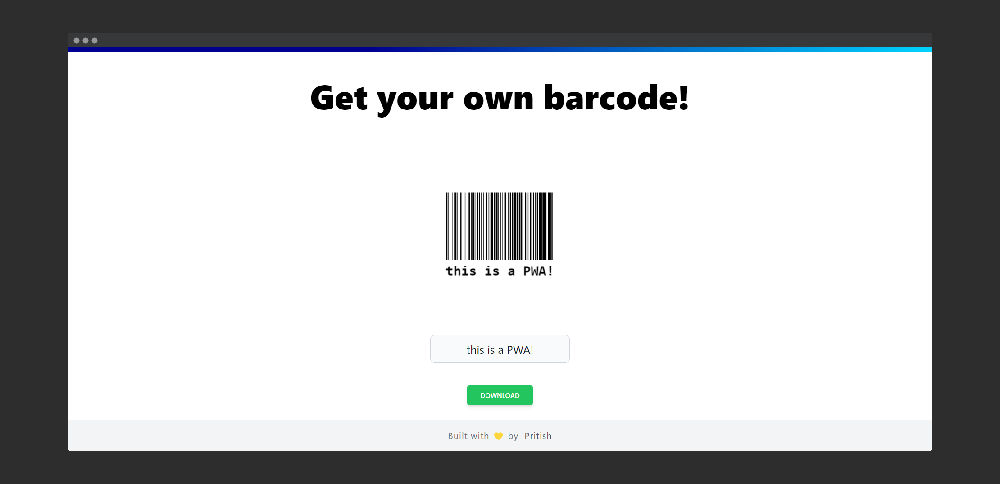

  
  
  # react-barcode-app
  a react PWA that generates custom barcodes which can be downloaded

## Features
- mobile-first and responsive design
- generates custom barcode based on input 
- disables the download button on empty input
- lets the user download the barcode in PNG format
- can be downloaded as a mobile or desktop app (PWA - progressive web app)

### Upcoming features
- [ ] more customization
    - [ ] different barcode widths on different screen sizes
    - [ ] SVG download option
    - [ ] different barcode types
    - [ ] all of [these](https://www.npmjs.com/package/next-barcode#options) features

- [X] PWA support
